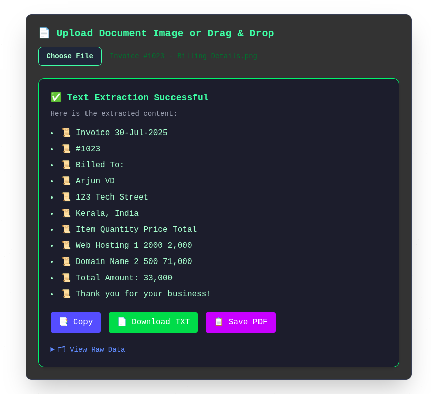

# 🧠 Cyber-Noir OCR Scanner

A modern, cyber-noir-themed image-to-text extractor built with **Vue 3**, **Tailwind CSS**, **Tesseract.js**, and **jsPDF**. Supports drag-and-drop, text enhancement, and export to TXT, PDF, and clipboard.



---

## 🚀 Features

- 🎯 **OCR Text Extraction** with `tesseract.js`
- 🖼️ **Image Enhancement** (contrast and grayscale preprocessing)
- 🖱️ **Drag & Drop Upload** or traditional file input
- 📋 **Export Options**:
  - Copy to clipboard
  - Download as `.txt`
  - Save as `.pdf` using `jsPDF`
- 🧾 **Raw Output Viewer** (toggleable)
- 🌃 **Cyber-Noir UI** with newspaper-style texture background

---

## 🛠️ Tech Stack

- [Vue 3 + `<script setup>`](https://vuejs.org/)
- [Tesseract.js](https://github.com/naptha/tesseract.js)
- [Tailwind CSS](https://tailwindcss.com/)
- [jsPDF](https://github.com/parallax/jsPDF)
- Vite build system

---

## 📦 Install & Run

```bash
git clone https://github.com/ArjunvDevaraj/cyber-noir-ocr-scanner.git
cd cyber-noir-ocr-scanner
npm install
npm run dev
```

---

## 🧪 Usage

1. Upload or drag an image (e.g., scanned receipt, printed document).
2. Let the app enhance the image.
3. Extracted text will be displayed.
4. Choose to:
   - Copy to clipboard
   - Download as TXT
   - Save as PDF

---

## 📁 Project Structure

```
src/
├── components/
│   └── OcrScanner.vue   # Main scanner component
├── assets/
├── App.vue
└── main.js
```

---

## ✅ To-Do / Ideas

- 🌐 Multi-language OCR support
- 🧠 AI-based noise removal
- 🖨️ Batch processing
- 💾 Cloud storage integrations (optional)

---

## 👤 Author

- **GitHub**: [ArjunvDevaraj](https://github.com/ArjunvDevaraj)
- **LinkedIn**: [linkedin.com/in/arjunvdevaraj](https://www.linkedin.com/in/arjunvdevaraj)

---

## 📄 License

MIT License © 2025 Arjun V D